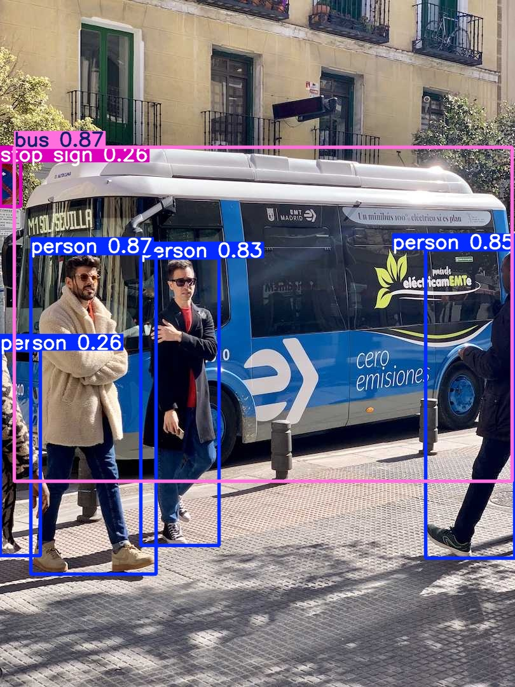
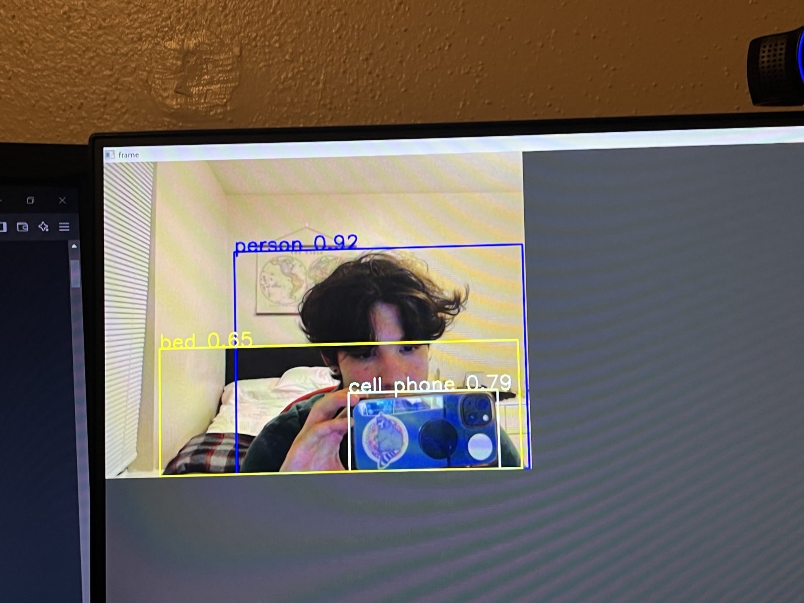

## Stage 1:

### For people interested in autonomous, give this project a shot and see if you can have it complete by Wednesday and at Monday's meeting I can help people that are stuck good luck!

For the people getting into coding this stage will mostly be understanding how to clone repositories  
and getting the correct dependencies to run somebody elses code.

So firstly, you can use whatever code editor you want I personally use VS Code and  
I want you to clone down the [Yolov8 Repository](https://github.com/ultralytics/ultralytics)  

Next, make sure to have the proper dependencies, It says on the github to have [Python>=3.8](https://www.python.org/)  
as well as [PyTorch>=1.8](https://pytorch.org/get-started/locally/) 

And finally, follow the Quickstart installation guide and try to run the first CLI script.  

The outcome should look like this: 

## Stage 2:

Now stage 2 will be a little more coding oriented, you're going to create a new program using [OpenCV](https://docs.opencv.org/4.10.0/) to  
access your device's webcam and import yolov8n to create bounding boxes and track the objects of interest.  

The default pretrained yolo model is trained on several items called classes (like people, chairs, phones, remotes,  
EVERYTHING kinda)  

Your bounding boxes can be color coded by the different classes it finds like shown in the outcome photo or  
completly random its all up to you (also guys this isnt a coding class you can use all available resources 😏)  

We just want to see that you're capable of coding something and at the very least, understanding what you've  
just coded.

Outcome looks like this its displaying the bounding box, class, and confidence number:

## Stage 3  (OPTIONAL)

This is only here cause I did it and it was a fun experience for me and maybe somebody is also interested enough  
to give it a try

Basically what I did was grabbed a random dataset with the images and labels from a community website like [roboflow](https://universe.roboflow.com/)  
and retrained a yolo pretrained model on it. You dont need a good computer to do this because theres websites like  
[Google Colab](https://colab.research.google.com/) that let you use their nice and beefy computers to train your model. PLUS its all in a Jupyter Notebook  
environment which is a nice thing to learn and get comfortable with.