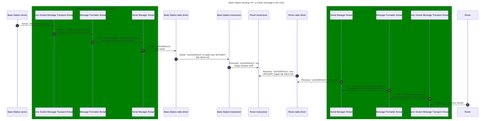

# radiodriver-proxy

## Overview
This service is for the the base station and ROS nodes to handle logic for sending and receiving messages with the [radio driver](http://github.com/comet-robotics/urc-radiodriver), as an alternative/backup option for the Wi-Fi TCP uplink. There is additional logic needed to \[un-\]wrap messages before they are sent/received to the radio driver which this process handles, removing the need to implement serial support and KISS framing support in both the base station and ROS nodes. Both the base station and rover will have local instances of this service running.

To send a message via radio, other processes simply write an integer representing the size of the upcoming data in bytes, followed by the message data, to the Unix socket at `/var/run/radiodriver-proxy.sock`. The proxy will receive the message, frame it, and send it to the radio driver via serial for transmission.

When the radio driver receives a message from the radio, it sends the message back to this proxy over serial. Then, the proxy will unframe the message, and send it to the receiving process via Unix socket. The receiving process will listen for data on the Unix socket at `/var/run/radiodriver-proxy.sock`, again consisting of an integer, representing the size of the message in bytes, followed by the message data.

## Testing
To test, you'll want to be on a Unix-based system due to the proxy's dependence on Unix sockets, so the steps here will assume you're on a Unix-based system. Windows 11 and some Windows 10 versions [should support Unix sockets](https://devblogs.microsoft.com/commandline/af_unix-comes-to-windows/), though I haven't tested this so your mileage may vary. You might need to edit the socket path to point to a location that would exist on a Windows system. 

The proxy requires elevated permissions to run due to the location of the Unix socket, so start the proxy like so:
```
sudo python proxy.py
```
then run the base station
then run the fake rover as sudo so it can connect to the socket

## Design
The proxy runs 3 threads which each take care of 1-2 tasks in order to prevent issues with blocking. The threads pass data on to each other using through a number of shared queues. 

The message transport thread handles sending and receiving messages (bytes) over the Unix socket used to communicate with upstream applications like the base station and ROS nodes. The serial manager thread handles sending and receiving bytes over the serial port used to communicate with the radio driver. The message formatter thread handles framing messages before they are passed to the serial manager thread, and unframing messages when they are received by the serial manager thread.

This diagram shows the flow of a 2-byte message, 'Hi', being sent from the base station to the rover via ham link.

<!-- NOTE: This is a diagram written using Mermaid syntax. A rendered version of this graph should be displayed when previewing this Markdown file on GitHub. -->
<!-- TODO: I could probably separate this into 3 separate sequence diagrams: one that goes base -> base proxy -> rover proxy -> rover, one that goes into the steps on the base proxy to TX, and one that goes into the the steps on the rover to RX, making 3 smaller/less complex diagrams as opposed to one giant one that is annoying to look at -->


